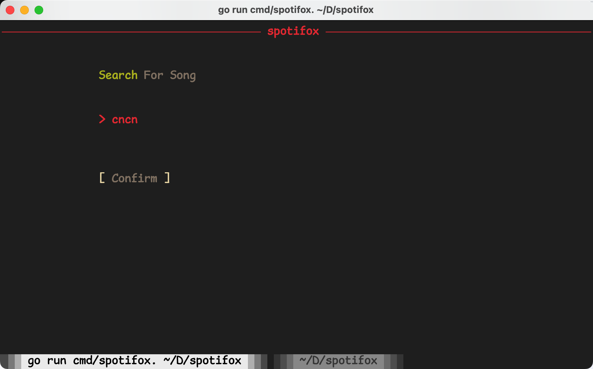

# Spotifox

English | [简体中文](./README_CN.md)

Spotifox is yet another spotify CLI client similar to [go-mousicfox](https://github.com/go-musicfox/spotifox).

> UI base on [charmbracelet/bubbletea](https://github.com/charmbracelet/bubbletea)

    

 

<p></p>

([The icon](https://github.com/go-musicfox/go-musicfox-icon) is based on [kitty-icon](https://github.com/DinkDonk/kitty-icon))

------------------------------

## Preview

#### 1. Startup


#### 2. MainUI


#### 3. Notification


#### 4. Login


#### 5. Search



#### 6. macOS NowPlaying


## Install

### macOS

#### 1. Homebrew

```sh
$ brew install go-musicfox/go-musicfox/spotifox
```

#### 2. Binary

Download binary file => [Release](https://github.com/go-musicfox/spotifox/releases/latest)

### Linux

#### 1. Homebrew

```sh
$ brew install go-musicfox/go-musicfox/spotifox
```

#### 2. Binary

Download binary file => [Release](https://github.com/go-musicfox/spotifox/releases/latest)

### Windows

#### 1. Scoop

```sh
scoop bucket add spotifox https://github.com/go-musicfox/spotifox.git

scoop install spotifox
```

#### 2. Binary

Download binary file => [Release](https://github.com/go-musicfox/spotifox/releases/latest)

### Manual Build

```sh
$ git clone https://github.com/go-musicfox/spotifox
$ go mod download
$ make
$ make install
```

## Usage

```sh
$ spotifox
```

### Notice

- **Please be sure to use a fixed width font or set the configuration item `dualColumn` to `false`, otherwise the dual column display layout may be confusing**


### Shortcut keys

|       Key        |               Effect               |    Remark    |
|:----------------:|:----------------------------------:|:------------:|
|   `h`/`H`/`←`    |             Move left              |              |
|   `l`/`L`/`→`    |             Move right             |              |
|   `k`/`K`/`↑`    |              Move up               |              |
|   `j`/`J`/`↓`    |             Move down              |              |
|       `g`        |            Move to top             |              |
|       `G`        |           Move to bottom           |              |
|     `q`/`Q`      |                Quit                |              |
|     `Space`      |             Paly/Pause             |              |
|       `[`        |              Pre song              |              |
|       `]`        |             Next song              |              |
|       `-`        |            Down volume             |              |
|       `=`        |             Up volume              |              |
| `n`/`N`/`Enter`  |             Enter menu             |              |
| `b`/`B`/`Escape` |                Back                |              |
|     `w`/`W`      |          Logout and quit           |              |
|       `p`        |          Switch play mode          |              |
|     `r`/`R`      |            Rerender UI             |              |
|     `c`/`C`      |          Current Playlist          |              |
|       `,`        |         Like playing song          |              |
|       `<`        |         Like selected song         |              |
|       `.`        |        Dislike playing song        |              |
|       `>`        |       Dislike selected song        |              |
|     `` ` ``      |    Add playing song to playlist    |              |
|       `~`        | Remove playing song from playlist  |              |
|      `Tab`       |   Add selected song to playlist    |              |
|   `Shift+Tab`    | Remove selected song from playlist |              |
|       `/`        |      Search current menu list      |              |
|       `?`        |                Help                |              |
|       `a`        |       Album of playing song        |              |
|       `A`        |       Album of selected song       |              |
|       `s`        |       Artist of playing song       |              |
|       `S`        |      Artist of selected song       |              |
|       `o`        |   Open playing song in brownser    |              |
|       `O`        |   Open selected item in brownser   |              |
|     `;`/`:`      |      Follow selected playlist      |              |
|     `'`/`"`      |     Unfollow selected playlist     |              |

## Configuration

Configuration file path:

```shell
spotifox config
```

> Set environment variables(`SPOTIFOX_ROOT`) to change the configuration file path

[Sample](./utils/embed/spotifox.ini)


## Similar Projects

* [go-musicfox/go-musicfox](https://github.com/go-musicfox/go-musicfox)

## Donate

<a href="https://www.buymeacoffee.com/anhoder"></a>

## Thanks

Thanks to the following projects and their contributors (but not limited to):

* [bubbletea](https://github.com/charmbracelet/bubbletea)
* [beep](https://github.com/faiface/beep)
* [musicbox](https://github.com/darknessomi/musicbox)
* [gcli](https://github.com/gookit/gcli)
* ...


[](https://star-history.com/#go-musicfox/spotifox&Date)

