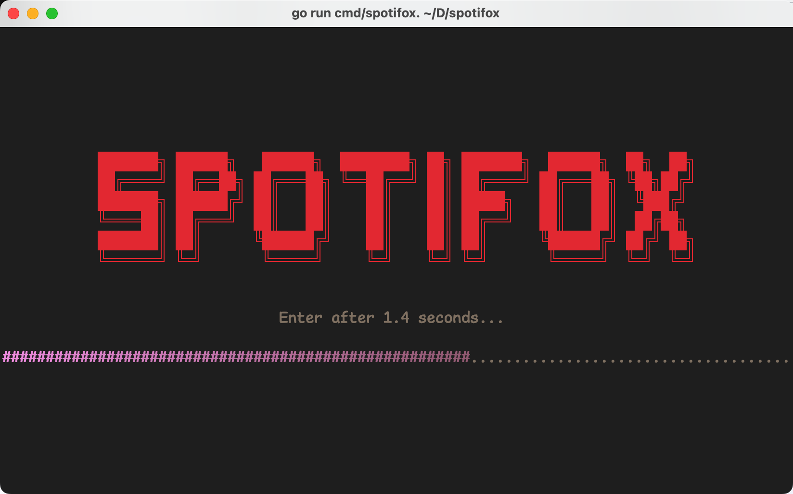
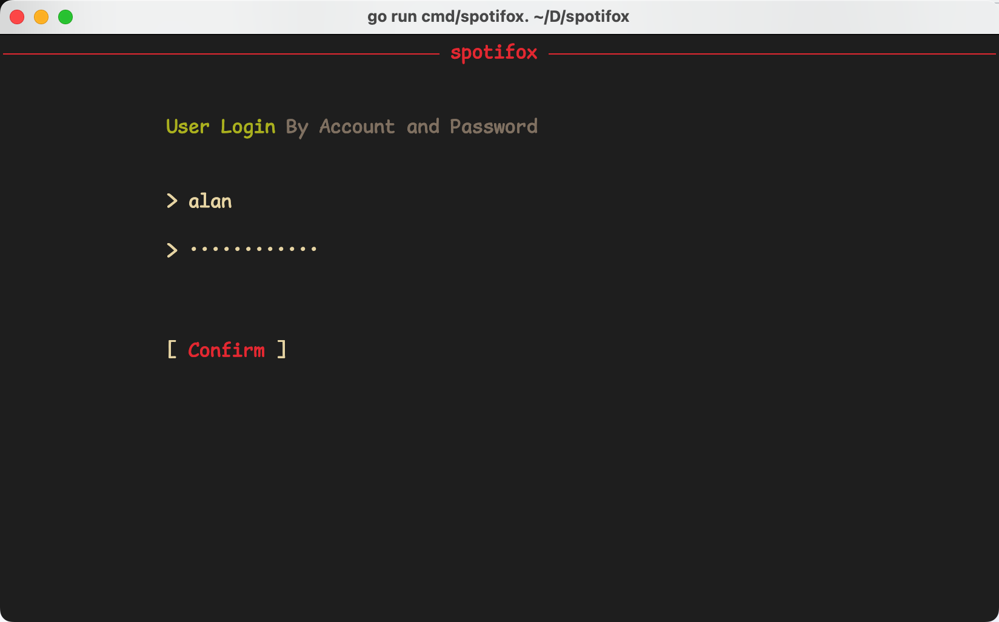

# Spotifox

[English](./README.md) | 简体中文

Spotifox 是一个类似 [go-mousicfox](https://github.com/go-musicfox/spotifox) 的Spotify命令行客户端.

> **网易云版 - [go-musicfox](https://github.com/go-musicfox/go-musicfox)**

> UI 基于 [charmbracelet/bubbletea](https://github.com/charmbracelet/bubbletea)

    

 

<p></p>

([The icon](https://github.com/go-musicfox/go-musicfox-icon) is based on [kitty-icon](https://github.com/DinkDonk/kitty-icon))

------------------------------

## 预览

#### 1. 启动页



#### 2. 主页面


#### 3. 通知


#### 4. 登录页



#### 5. 搜索页


#### 6. macOS NowPlaying


## 安装

### macOS

#### 1. Homebrew

```sh
$ brew install anhoder/go-musicfox/spotifox
```

#### 2. Binary

下载二进制问价 => [Release](https://github.com/go-musicfox/spotifox/releases/latest)

### Linux

#### 1. Homebrew

```sh
$ brew install anhoder/go-musicfox/spotifox
```

#### 2. Binary

下载二进制文件 => [Release](https://github.com/go-musicfox/spotifox/releases/latest)

### Windows

#### 1. Scoop

```sh
scoop bucket add spotifox https://github.com/go-musicfox/spotifox.git

scoop install spotifox
```

#### 2. Binary

下载二进制文件 => [Release](https://github.com/go-musicfox/spotifox/releases/latest)

### 手动编译

```sh
$ git clone https://github.com/go-musicfox/spotifox
$ go mod download
$ make
$ make install
```

## 使用

```sh
$ spotifox
```

### Notice

- **请确保使用等宽字体或将配置项 `dualColumn` 设置为 `false`, 否则双列显示会很混乱**


### 快捷键

|        按键        |                 作用                 | 备注 |
|:----------------:|:----------------------------------:|:--:|
|   `h`/`H`/`←`    |             Move left              |    |
|   `l`/`L`/`→`    |             Move right             |    |
|   `k`/`K`/`↑`    |              Move up               |    |
|   `j`/`J`/`↓`    |             Move down              |    |
|       `g`        |            Move to top             |    |
|       `G`        |           Move to bottom           |    |
|     `q`/`Q`      |                Quit                |    |
|     `Space`      |             Paly/Pause             |    |
|       `[`        |              Pre song              |    |
|       `]`        |             Next song              |    |
|       `-`        |            Down volume             |    |
|       `=`        |             Up volume              |    |
| `n`/`N`/`Enter`  |             Enter menu             |    |
| `b`/`B`/`Escape` |                Back                |    |
|     `w`/`W`      |          Logout and quit           |    |
|       `p`        |          Switch play mode          |    |
|     `r`/`R`      |            Rerender UI             |    |
|     `c`/`C`      |          Current Playlist          |    |
|       `,`        |         Like playing song          |    |
|       `<`        |         Like selected song         |    |
|       `.`        |        Dislike playing song        |    |
|       `>`        |       Dislike selected song        |    |
|     `` ` ``      |    Add playing song to playlist    |    |
|       `~`        | Remove playing song from playlist  |    |
|      `Tab`       |   Add selected song to playlist    |    |
|   `Shift+Tab`    | Remove selected song from playlist |    |
|       `/`        |      Search current menu list      |    |
|       `?`        |                Help                |    |
|       `a`        |       Album of playing song        |    |
|       `A`        |       Album of selected song       |    |
|       `s`        |       Artist of playing song       |    |
|       `S`        |      Artist of selected song       |    |
|       `o`        |   Open playing song in brownser    |    |
|       `O`        |   Open selected item in brownser   |    |
|     `;`/`:`      |      Follow selected playlist      |    |
|     `'`/`"`      |     Unfollow selected playlist     |    |

## 配置文件

配置文件路径:

```shell
spotifox config
```

> 可以通过设置环境变量(`SPOTIFOX_ROOT`)修改配置文件路径

[样例](./utils/embed/spotifox.ini)


## 相似的项目

* [go-musicfox/go-musicfox](https://github.com/go-musicfox/go-musicfox)

## 感谢

感谢以下项目及其贡献者（但不限于）：

* [bubbletea](https://github.com/charmbracelet/bubbletea)
* [beep](https://github.com/faiface/beep)
* [musicbox](https://github.com/darknessomi/musicbox)
* [gcli](https://github.com/gookit/gcli)
* ...


[](https://star-history.com/#go-musicfox/spotifox&Date)
